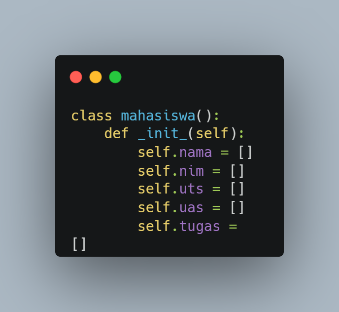
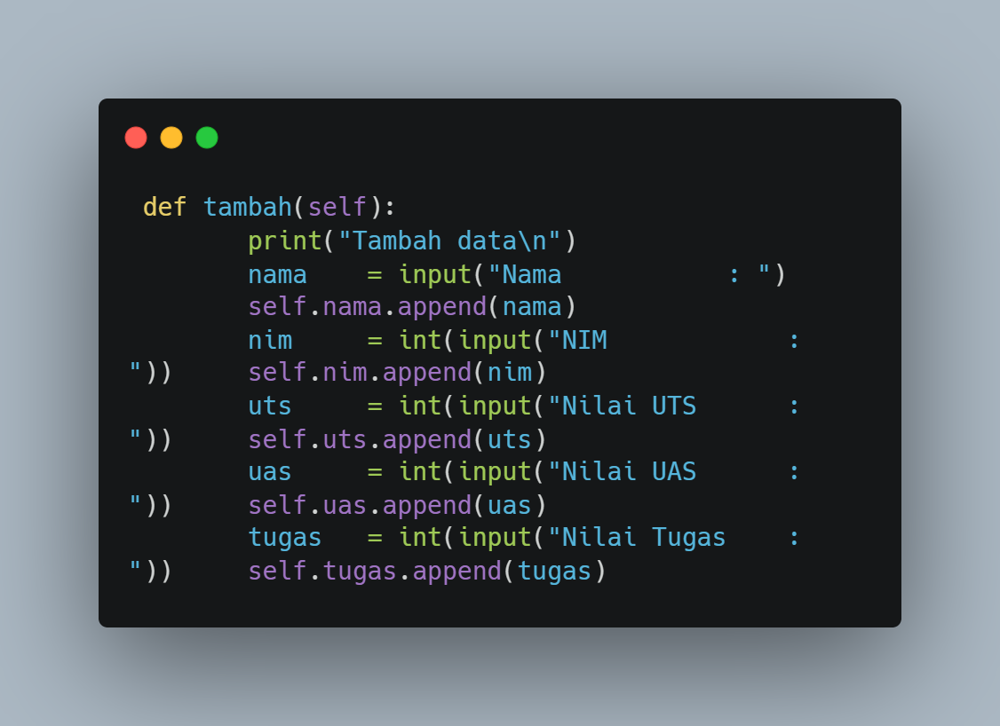
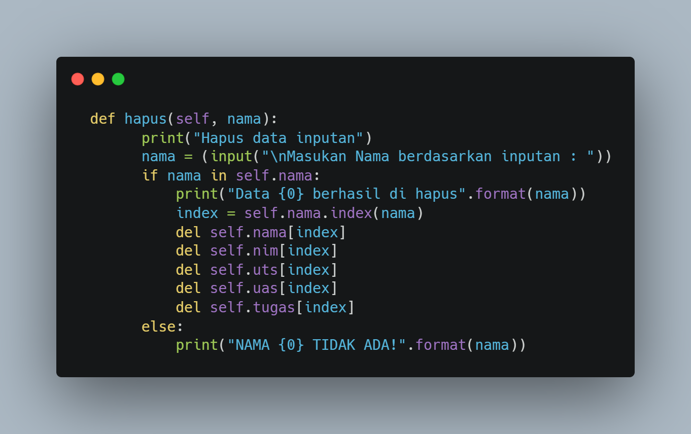
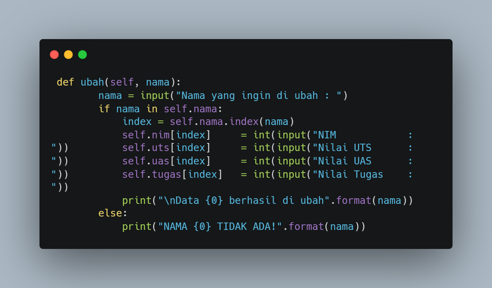
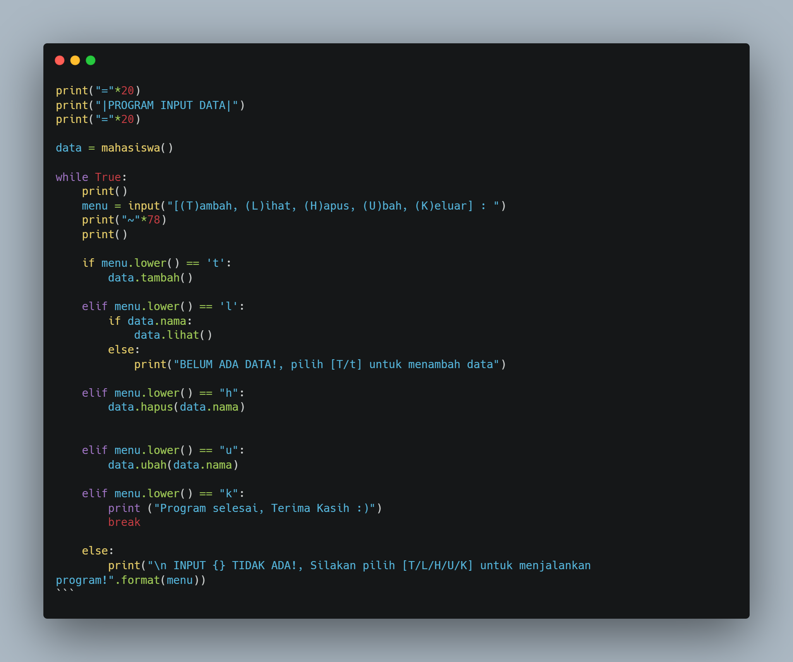
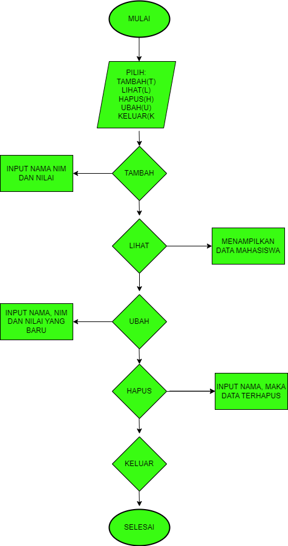

# Pertemuan ke 12
# OOP

| Variable | Isi |
| -------- | --- |
| **Nama** | Andika Setiawan |
| **NIM** | 312310470 |
| **Kelas** | TI.23.A.5 |
| **Mata Kuliah** | Bahasa Pemrograman |

# Tugas Praktikum

## Buat program sederhana dengan mengaplikasikan penggunaan class. Buatlah class untuk menampilkan daftar nilai mahasiswa, dengan ketentuan:
- Method tambah() untuk menambah data
- Method tampilkan() untuk menampilkan data
- Method hapus(nama) untuk menghapus data berdasarkan nama
- Method ubah(nama) untuk mengubah data berdasarkan nama

- Buat diagram class, flowchart dan penjelasan programnya pada
README.md.
- Commit dan push repository ke github.




* Membuat ```class mahasiswa():``` dengan instance class



* Menambahkan method / fungsi, pada data inputan `Nama`, `NIM`, `UTS`, `UAS`, `Tugas`.
```python
    # Menampilkan seluruh data 
    def lihat(self):
        for i in range(len(self.nama)):
            print(f"\nData ke -{i+1}")
            print(f"Nama Mahasiswa: {self.nama[i]}")
            print(f"NIM Mahasiswa : {self.nim[i]}")
            print(f"Nilai UTS     : {self.uts[i]}")
            print(f"Nilai UAS     : {self.uas[i]}")
            print(f"Nilai TUGAS   : {self.tugas[i]}")
```
* Menampilkan method / fungsi. `f` = Format


* Menghapus data yg sudah di input. ```del self.nama[index]``` = menghapus nama
* ```[index]``` Berfungsi agar inputan menjadi object


* Mengubah data yg sudah di input
* ```index = self.nama.index(nama)``` Membuat variable index dengan ```self.nama``` di dalam nya



* Perulangan dengan memilih [T/L/H/U/K] untuk menjalankan program apa yg ingin di gunakan.

## Hasil Program
### Menambahkan data & Melihat data


### Mengubah & menghapus data


## Flowchartnya 

